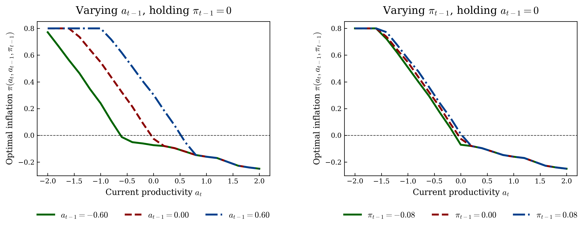
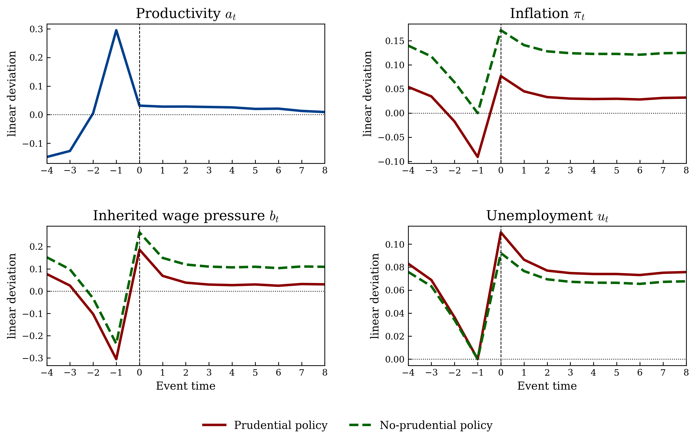
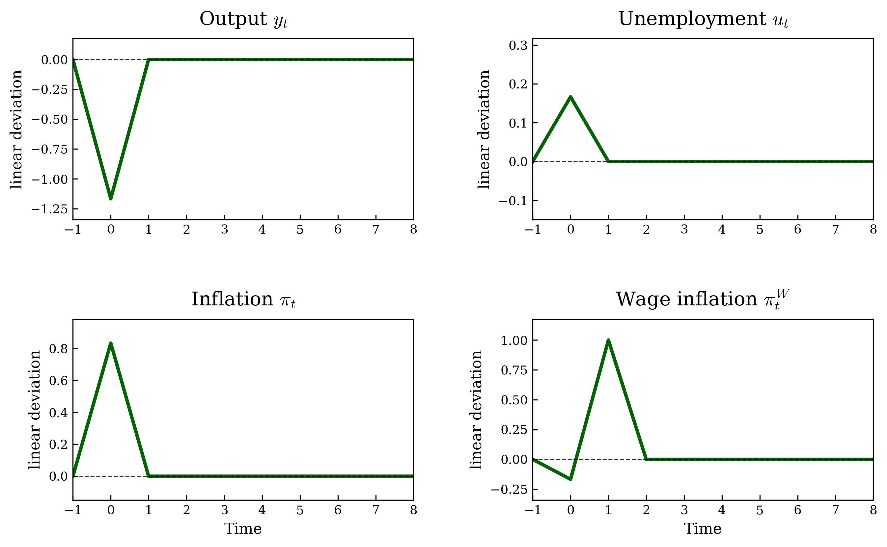
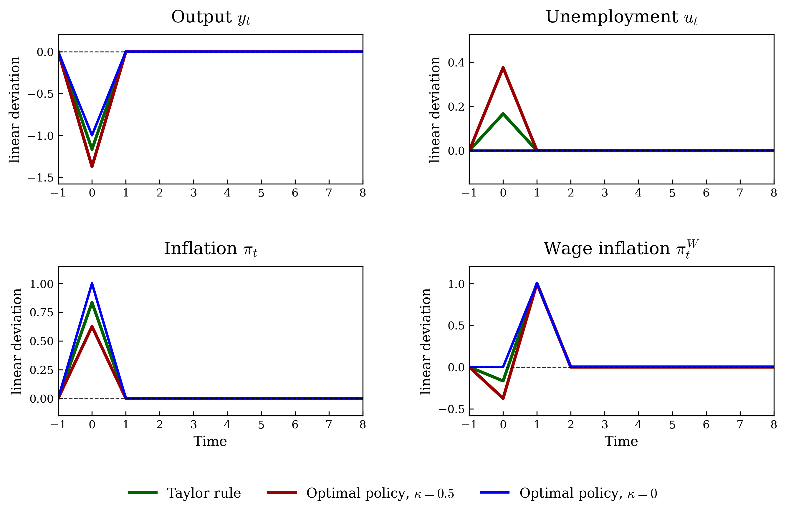
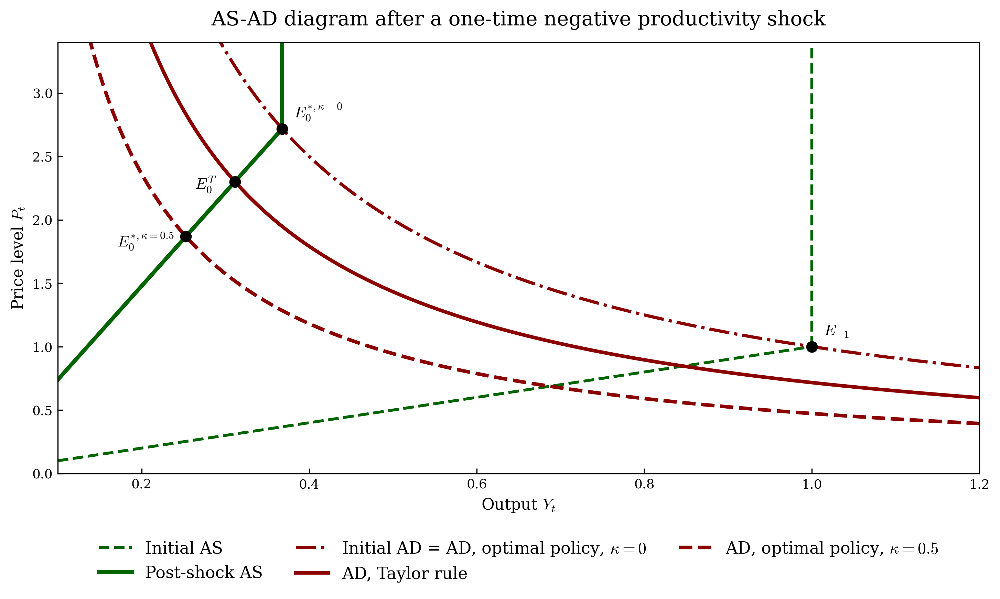
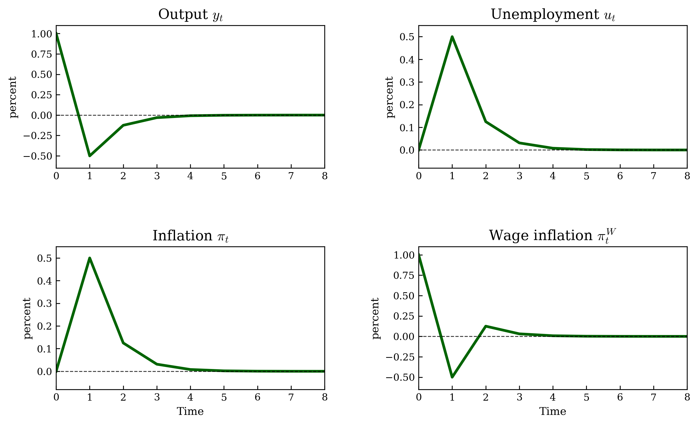
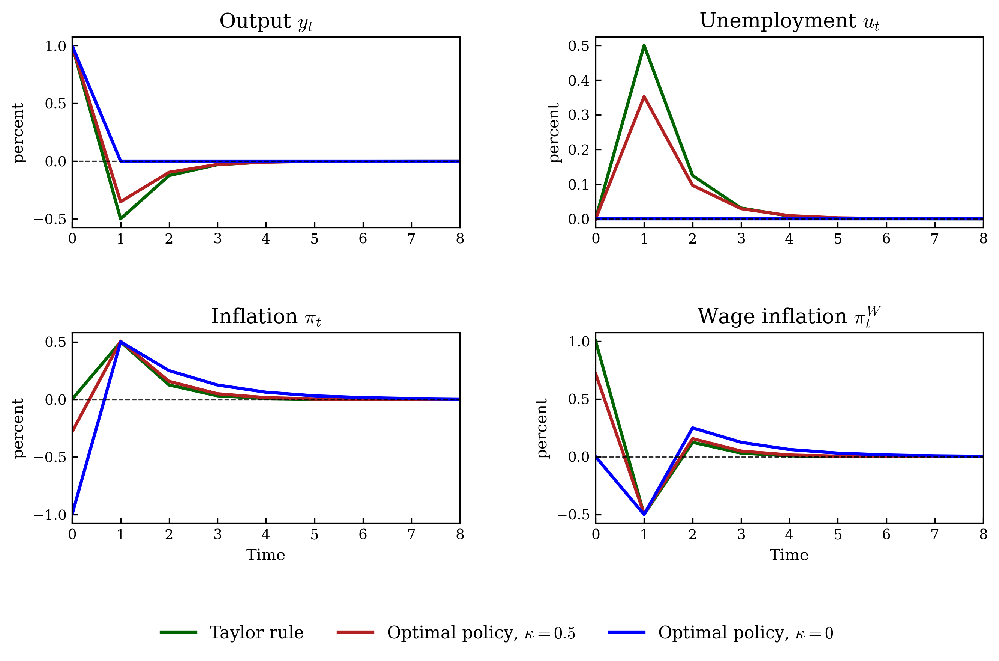
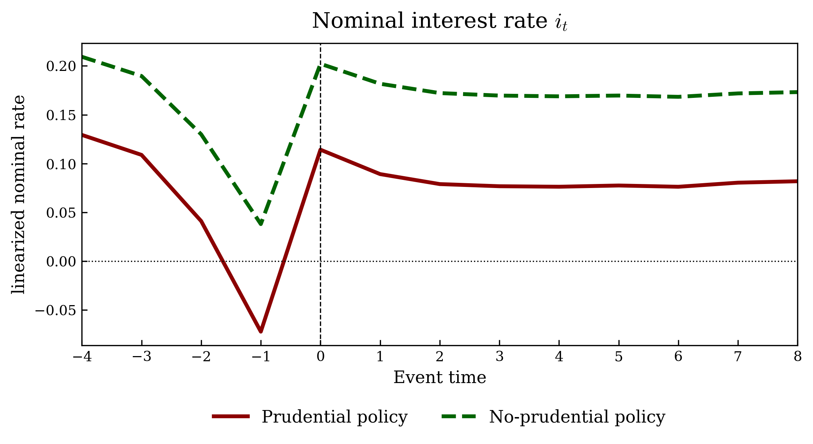

# Prudential Monetary Policy under Downward Nominal Wage Rigidity

A computational study of optimal monetary policy when downward nominal wage rigidity creates an intertemporal trade-off between current inflation stabilization and future unemployment.

The project combines **analytical macroeconomics, dynamic programming, numerical optimization, Monte Carlo simulation, welfare analysis, and event-study methods**.

Developed by **Gabriele Casto** and **Francesco Donghi** as part of the *Advanced Macroeconomics III* course at the **University of St. Gallen**.

---

## Overview

This project studies monetary policy in an economy with **downward nominal wage rigidity (DNWR)**.

The central mechanism is dynamic: inflation today affects the nominal wage benchmark inherited by the economy tomorrow. If productivity subsequently falls, a high inherited wage level can make the wage-rigidity constraint binding, forcing the economy to adjust through inflation, unemployment, or both.

This creates a **prudential motive for monetary policy**.

Rather than focusing only on contemporaneous inflation and unemployment, an optimal central bank internalizes how today's inflation choices affect future labor-market constraints.

The analysis moves from deterministic one-time productivity shocks to a fully stochastic model with repeated productivity shocks.

---

## Economic Mechanism

The stochastic state of the economy is

$$
s_t = (a_t, a_{t-1}, \pi_{t-1}),
$$

where:

- $a_t$ is current productivity;
- $a_{t-1}$ is lagged productivity;
- $\pi_{t-1}$ is inherited inflation.

Downward nominal wage rigidity implies

```math
u_t =
\max \left\{
0,\,
\frac{\lambda \pi_{t-1} - \pi_t - a_t + a_{t-1}}{\xi}
\right\}.
```

Under optimal monetary policy, the inflation-unemployment trade-off can be summarized by the stochastic target rule

```math
1 - e^{-u_t}
=
\xi \kappa \pi_t
+
\beta \lambda E_t
\left[
1 - e^{-u_{t+1}}
\right].
```

The final term is the key **prudential component**.

Higher inflation today raises the indexed wage benchmark inherited next period. If productivity later deteriorates, this can tighten the wage constraint and increase future unemployment. The optimal central bank therefore has an incentive to restrain inflation during strong economic conditions in order to reduce future wage pressure.

---

## Methodology

The project combines analytical and numerical methods:

- analytical impulse responses to one-time productivity shocks;
- Taylor-rule and optimal-policy comparisons;
- AS-AD analysis;
- constrained numerical optimization;
- dynamic programming;
- value function iteration;
- Gaussian quadrature for conditional expectations;
- multidimensional interpolation of policy functions;
- Monte Carlo simulation;
- welfare comparisons;
- event studies around episodes in which downward nominal wage rigidity becomes binding.

The stochastic problem is solved numerically over the three-dimensional state space

$$
(a_t, a_{t-1}, \pi_{t-1}),
$$

with inflation as the policy choice and unemployment implied by the DNWR constraint.

---

## Optimal Inflation Policy

The numerical solution shows how optimal inflation varies with current productivity and inherited macroeconomic conditions.

<p align="center">
  
</p>

In boom states, optimal inflation remains contained and can become slightly negative. The central bank does not exploit strong productivity conditions to generate additional inflation because doing so would increase the nominal wage benchmark inherited by the future economy.

This is the core prudential mechanism of the model.

---

## Prudential vs. No-Prudential Policy

To quantify the value of prudential behavior, the project compares two economies exposed to the **same sequence of productivity shocks**:

- **Prudential policy (OP):** the central bank solves the full dynamic problem and internalizes the effect of current inflation on future wage constraints.
- **No-prudential policy (NP):** the central bank optimally trades off current inflation and current unemployment but ignores the effect of today's inflation on future wage pressure.

The comparison therefore isolates the value of the intertemporal component of monetary policy.

### Event study around binding DNWR episodes

<p align="center">
  
</p>

The event study focuses on episodes in which unemployment under the no-prudential policy becomes positive after previously being zero.

Before these episodes, the prudential regime enters with **lower inflation and lower inherited wage pressure**.

The policy does not mechanically minimize unemployment in every period. Instead, it changes the intertemporal allocation of inflation and labor-market distortions.

---

## Quantitative Results

The baseline stochastic experiment simulates **100,000 periods**, after discarding a burn-in of **5,000 observations**, and exposes both policy regimes to the same productivity shocks.

| Moment | Prudential policy | No-prudential policy |
| --- | ---: | ---: |
| Mean unemployment | 0.073366 | 0.065676 |
| Frequency of binding DNWR | 0.582910 | 0.623610 |
| Mean unemployment when binding | 0.125862 | 0.105315 |
| 95th percentile of unemployment | 0.257888 | 0.229850 |
| Output-gap volatility | 0.091559 | 0.080708 |
| Inflation volatility | 0.132557 | 0.143697 |
| Average welfare flow | -1.001383 | -1.004293 |

The results highlight an important trade-off.

Under the baseline calibration, prudential monetary policy:

- **increases average welfare**;
- **reduces inflation volatility**;
- **reduces the frequency with which DNWR becomes binding**;
- accepts greater labor-market adjustment in some states.

The welfare gain therefore does not come from minimizing unemployment period by period. It comes from improving the **timing of stabilization policy** across states and over time.

These are model-based simulation results and should be interpreted as comparisons across policy regimes rather than empirical estimates.

---

## First-Best Welfare Comparison

The project also compares the two DNWR economies with a **first-best economy without downward nominal wage rigidity**.

The theoretical welfare ordering is

$$
W^{FB} \geq W^{OP} \geq W^{NP}.
$$

Under the baseline simulation, prudential monetary policy recovers approximately **20.9% of the welfare gap** between the no-prudential economy and the first-best benchmark.

This illustrates both the value and the limitation of prudential monetary policy: the central bank can internalize the intertemporal wage-pressure effect generated by current inflation, but it cannot eliminate the underlying nominal rigidity itself.

---

## One-Time Productivity Shocks

The project first develops the mechanism analytically using deterministic one-time productivity shocks.

### Negative productivity shock

Under a Taylor rule, a negative productivity shock is stagflationary: output falls, unemployment rises, and inflation increases.

<p align="center">
  
</p>

Optimal monetary policy instead chooses the inflation-unemployment trade-off directly.

<p align="center">
  
</p>

The corresponding AS-AD representation shows how the supply shock and alternative monetary-policy regimes determine the impact equilibrium.

<p align="center">
  
</p>

### Positive productivity shock

A temporary positive productivity shock can generate a **boom-bust cycle** when the economy inherits a high nominal wage level after productivity returns to normal.

<p align="center">
  
</p>

Optimal monetary policy behaves prudentially by restraining inflation during the boom, reducing the severity of the subsequent adjustment.

<p align="center">
  
</p>

---

## Implementing Nominal Interest Rate

Once the optimal allocation is determined, the nominal interest rate required to implement it is recovered from the Euler equation.

<p align="center">
  
</p>

The interest-rate path reflects the different inflation and output allocations implemented under prudential and no-prudential monetary policy.

---

## Repository Structure

```text
Optimal-Monetary-Policy/
│
├── prudential_monetary_policy.py
├── README.md
│
├── figures/
│   ├── negative_shock_taylor_rule.png
│   ├── negative_shock_taylor_rule.pdf
│   ├── negative_shock_optimal_policy.png
│   ├── negative_shock_optimal_policy.pdf
│   ├── negative_shock_as_ad.png
│   ├── negative_shock_as_ad.pdf
│   ├── positive_shock_taylor_rule.png
│   ├── positive_shock_taylor_rule.pdf
│   ├── positive_shock_optimal_policy.png
│   ├── positive_shock_optimal_policy.pdf
│   ├── optimal_inflation_policy.png
│   ├── optimal_inflation_policy.pdf
│   ├── prudential_policy_event_study.png
│   ├── prudential_policy_event_study.pdf
│   ├── nominal_interest_rate_event_study.png
│   └── nominal_interest_rate_event_study.pdf
│
├── results/
│   ├── unconditional_moments.csv
│   ├── unconditional_moments.tex
│   ├── prudential_policy_event_study.csv
│   └── nominal_interest_rate_event_study.csv
│
└── report/
    └── prudential_monetary_policy_report.pdf
```

---

## Reproducing the Results

### Requirements

The analysis is implemented in Python and requires:

- NumPy
- pandas
- Matplotlib
- SciPy

Install the required packages with:

```bash
pip install numpy pandas matplotlib scipy
```

### Run the analysis

From the repository root:

```bash
python prudential_monetary_policy.py
```

The script automatically creates the `figures/` and `results/` directories and exports the numerical outputs.

Figures are saved in both **PNG** and **PDF** format.

The stochastic simulation uses a fixed random seed for reproducibility.

---

## Full Report

A detailed presentation of the model, analytical derivations, numerical solution, simulations, event studies, and welfare comparison is available in the accompanying report:

**[Read the full report](report/prudential_monetary_policy_report.pdf)**

---

## Academic Context

This project was developed for:

**Advanced Macroeconomics III**  
**University of St. Gallen**  
June 2026

The repository presents the project in a research-oriented format while preserving the economic model, analytical derivations, numerical methodology, and results of the original coursework.

---

## Authors

**Gabriele Casto**  
**Francesco Donghi**

University of St. Gallen
